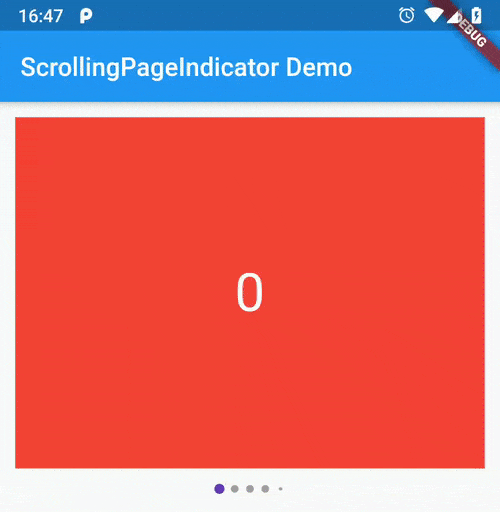

# scrolling_page_indicator

View page indicator like Instagram



## Getting Started

1) Dependency

```yaml
dependencies:
  scrolling_page_indicator: ^0.1.1
```
2) Install

`flutter packages get`

3) Import

```dart
import 'package:scrolling_page_indicator/scrolling_page_indicator.dart';
```

4) Use

```dart
ScrollingPageIndicator(
    dotColor: Colors.grey,
    dotSelectedColor: Colors.deepPurple,
    dotSize: 6,
    dotSelectedSize: 8,
    dotSpacing: 12,
    controller: _controller,
    itemCount: items.length,
)
```
